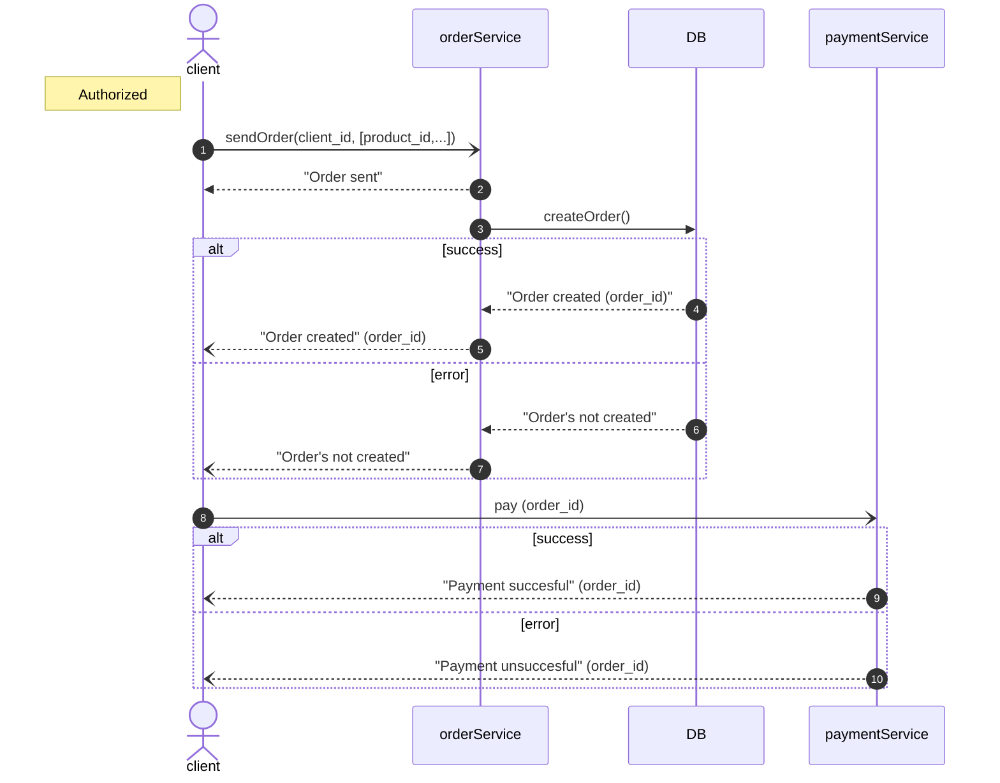

# Cпроектировать REST API по приему заявок для сервиса заявок.
Сам сервис принимает заявку от клиента, сохраняет в БД и возвращает ответ клиенту.  
В заявке есть сущности **Клиент**, **Платеж**, **Продукт**. Атрибуты заявки надо продумать самим. 
Необходимо:
- Определить метод и url.
- Подготовить пример запроса и ответа в формате json.
- Подготовить json-схему запроса и ответа.
- Описать основной и альтернативные сценарии работы сервиса.
## Прием заказ клиента

## Описание API
### Ресурсы
/v1/orders
#### Методы
POST /orders

#### Пример запроса
- sendOrder (client_id, [productId,...])
```JSON
{
    "client_id": 5,
    "products": [
        {
            "product_id": 1,
            "product_quantity": 2,
            "product_price": 3
        },
    ]
}
```
#### Пример запроса
- "Order created" (order_id)
```JSON
{
    "order_id": 1,
    "order_status": "Created"
}ˇ
```


- JSON-schema запроса
```JSON
{
    "$id": "https://abstract-order-service.com/v1/orders/schema.json",
    "$schema": "https://abstract-order-service.com/v1/orders/schema",
    "description": "Схема запроса на создание заявки.",
    "type": "object",
    "properties": {
        "client_id": {
            "type": "int"
        },
        "products": {
            "type": "array",
            "properties": {
                "type": "object",
                "properties": {
                    "product_id": {
                        "type": "int"
                    },
                    "product_quantity": {
                        "type": "int"
                    },
                    "product_price": {
                        "type": "int"
                    }
                }
            }
        }
    }
}
```

- JSON-schema ответа
```JSON
{
    "$id": "https://abstract-order-service.com/v1/orders/schema-get.json",
    "$schema": "https://abstract-order-service.com/v1/orders/schema-get",
    "description": "Схема ответа после создания заявки.",
    "type": "object",
    "properties": {
        "order_id": {
            "type": "int"
        },
        "order_status": {
            "type": "int"
        }
    }
}
```