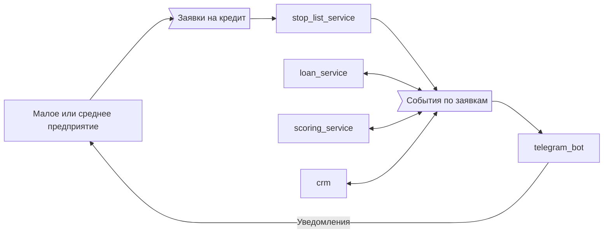

# Кейсы
## Банк
- Клиенты - предприятия малого и среднего бизнеса, отправляют заявку на займ денег.
- Клиент проверяется на нахождение в стоп листах. Сразу отказ, если в стоп листе.
- ТГ-бот рассылает уведомления о любом изменении ЖЦ заявки, например, заявка получена, скоринговая оценка проведена, заявка одобрена или отклонена, определены варианты кредитования и пр.
- Часть заявок обрабатывается автоматически, а часть – вручную (в зависимости от условий).
- В зависимости от разных условий заявки отправляются разным менеджерам на обработку.
- Каждая поступившая заявка проходит скоринговую оценку, в зависимости от которой предлагаются варианты кредитования.

