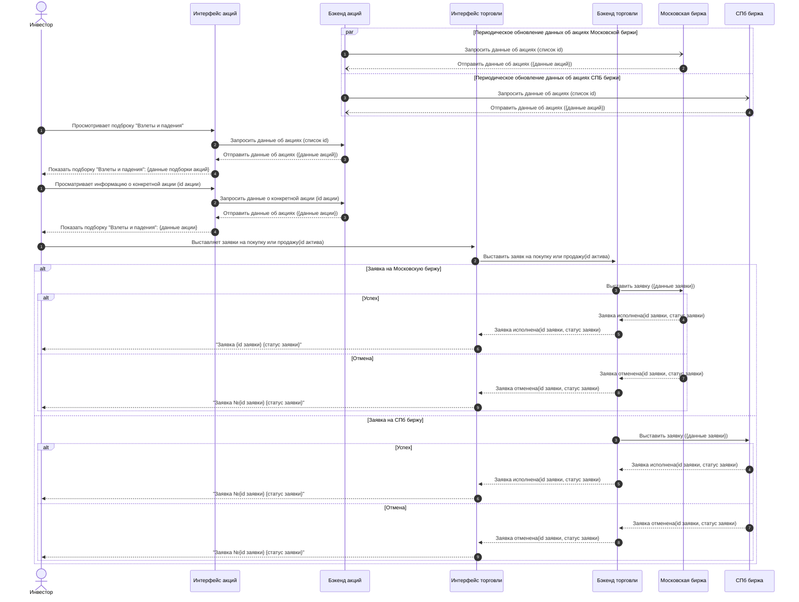

## Глоссарий
- Торговая сессия — время, когда биржа открыта и на ней можно торговать.

# Приложение "Инвестиции"
## Глоссарий
- Торговая сессия — время, когда биржа открыта и на ней можно торговать.
## Бизнес-правила
- Система должна позволять покупать и продавать акции в течении 100% времени торговой сессии.

## Пользовательские требования
- **NEW** Просмотреть подборку "Взлеты и падения".

### Просмотреть подборку "Взлеты и падения".
#### Функциональные требования
1. Система должна отображать блок "Взлеты и падения" на экране "Что купить".
2. Система должна отображать в блоке "Взлеты и падения" вкладки:
   1. "Взлеты дня"
   2. "Падения дня"
3. Система должна показывать во вкладке "Взлеты дня" топ 3 акции, которые больше всего выросли в процентах за предыдущую торговую сессию.
4. Система должна показывать на экране "Падения дня" топ 3 акций, которые больше всего упали в процентах за предыдущую торговую сессию.
5. Система должна позволять открыть топ 15 акций с вкладок "Взлеты дня" и "Падения дня".
6. Система должна показывать в списке информацию о каждой акции:
   1. Название эмитента
   2. Тикер
   3. Цена
   4. Абсолютное изменение цены в валюте акции
   5. Процентное изменение цены
7. Система должна отображать акции не активными в списке, когда по ним не ведутся торги.
8. Пользователь должен иметь возможность посмотреть информацию о конкретной акции из списка "Взлеты и падения":
   1. Название эмитента
   2. Тикер
   3. Цена в реальном времени
   4. Абсолютное изменение цены в валюте акции в реальном времени
   5. Процентное изменение цены в реальном времени.
   6. График изменения цены
9. Пользователь должен иметь возможность купить или продать акцию в течении торговой сессии при просмотре информации о конкретной акции.

#### Нефункциональные требования
1. Система должна показывать одинаковые данные в подборке "Взлеты и падения" на всех устройствах всех пользователей. См. п. 6 Функциональных требований.
2. Система должна показывать одинаковые данные в информации о конкретной акции на всех устройствах всех пользователей. См. п. 7 Функциональных требований.
3. Система должна обновлять подборку "Взлеты и падения" между торговыми сессиями.

### Диаграмма последовательности



```plainText
Написать JSON, который возвращает информацию для подборки "Взлеты и падения". 
на Главном экране (у вас будут такие данные, как название подборки
, 
название акции, 
цена, 
тикер и т.д., #картинка указана ниже, также можно смотреть прямо в приложении инвестиции).
Для написания JSON возьмите дизайн и посмотрите, какие данные есть (не забудьте про логотип, знак валюты, акции для падения, акции для взлета). Проверить на ошибки в синтаксисе можно в онлайн форматерах JSON, например, https://jsoneditoronline.org. Критерии - достоверность/полнота данных + отсутствие ошибок в синтаксисе. Обратите, что надо написать только JSON, без указания названия url и методов (это будет в след.задании).
2. Описать параметры в виде таблицы.
```

```JSON
{
   "$schema": "https://ivestments.tinkoff.ru/draft/2023-10/schema",
   "$id": "https://https://ivestments.tinkoff.ru/draft/2023-10/schema/bidding-leader-digest.json",
   "title": "Лидеры торгов бирже",
   "description": "Дайджест топов акций которые больше всего поднялись или опустились в цене за последние сутки",
   "type": "object",
   "properties": {
      "top-cutoff-title": {
         "description": "Заголовок мест топов",
         "type": "string"
      },
      "top-cutoff": {
         "description": "Количество мест топов",
         "type": "integer",
         "minimum": 1
      },
      "digest-name": {
         "description": "Название дайджеста",
         "type": "string"
      },
      "tops": {
         "description": "Коллекция топов",
         "type": "array",
         "items": {
            "type": "object",
            "properties": {
               "top-title": {
                  "description": "Заголовок топа",
                  "type": "string"
               },
               "top-description": {
                  "description": "Описание топа",
                  "type": "string",
                  "maxLength": 1000
               },
               "top-list": {
                  "description": "Список акций",
                  "type": "array",
                  "items": {
                     "$ref": "#/$defs/top-list-item"
                  }
               }
            }
         },
         "minItems": 1,
         "uniqueItems": true
      },
      "disclaimer": {
         "description":"Обязательная информация \"Не является инвестиционной рекомендацией\"",
         "type": "string"
      },
      "required": [
         "top-cutoff-title",
         "top-cutoff",
         "digest-name",
         "tops"
      ]
   },
   "$defs": {
      "top-list-item": {
         "type": "object",
         "properties": {
            "icon": {
               "description": "Ссылка на иконку акции",
               "type": "string",
               "maxLength": 255,
               "format": "uri"
            },
            "ticker-symbol": {
               "description": "Тикер акции",
               "type": "string",
               "maxLength": 6
            },
            "issuer": {
               "description": "Компания-эмитент акции",
               "type": "string"
            },
            "price": {
               "description": "Текущая цена акции",
               "type": "number",
               "exclusiveMinimum": 0
            },
            "price-change-absolute": {
               "description": " цена акции",
               "type": "number",
               "exclusiveMinimum": 0
            },
            "price-currency": {
               "description": "Знак валют акции",
               "type": "string",
               "maxLength": 1,
               "pattern": "\\p{Sc}"
            },
            "price-change-percent": {
               "description": "Процент изменения цены акции",
               "type": "number"
            },
            "is-tradable": {
               "description": "Признак доступности к торговле",
               "type": "boolean"
            },
            "is-tradable-icon":{
               "description": "Ссылка на иконку \"Недоступно к торговле\"",
               "type": "string",
               "maxLength": 255,
               "format": "uri"
            },
            "required": [
               "icon",
               "ticker-symbol",
               "issuer",
               "price",
               "price-change-absolute",
               "price-change-percent",
               "is-tradable"
            ]
         }
      }
   }
}
```
