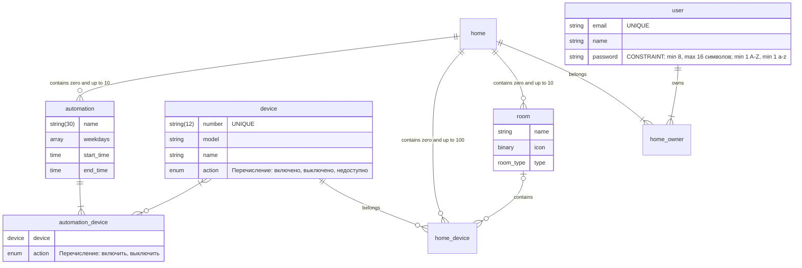

# Бизнес требования
1. Разработать приложение умного дома 
# Функциональные требования
1. Управлять учетной записью:
   1. создать учетную запись;
      - Обязательные поля: Имя, Email, Пароль.
   2. войти в приложение;
   3. восстановить забытый пароль;
   4. хранить настройки умных устройств;
   5. давать доступ другим пользователям
2. Управлять умным домом:
   1. Добавлять уникальные устуройства
      1. по QR коду
      2. через уникальный номер
   2. Убирать устройства
   3. Включать и Выключать устройство
   4. Включать и выключать режим энергосбережения
   5. Добавлять комнаты
      1. Выбирать тип комнаты (см. Apple и Google)
      2. Название формировать из типа комнаты и порядкового номера
      3. Изменять тип комнаты
   6. Удалять комнаты
   7. Добавлять устройство в комнату
   8. Удалять устройство из комнаты
   9. Включать и Выключать все устройства в комнате
3. Управлять маркетинговыми инструментами:
  1. Собирать статистику о количестве пользователей
  2. Отрпавлять пуш-уведомления
  3. Отправлять Email рассылки 

## Словарь данных
| Элемент данных    | Описание                                  | Тип                     | Длина         | Значения                                                               |
| ----------------- | ----------------------------------------- | ----------------------- | ------------- | ---------------------------------------------------------------------- |
| user              | Учетная запись пользователя               | Email + name + password |               |                                                                        |
| email             | Логин пользователя                        | Строка                  | 255           | RFC 2821                                                               |
| name              | Имя пользователя                          | Строка                  | 255           | Буквы русского алфавита. Пробелы.                                      |
| password          | Пароль пользователя                       | Строка                  | min 8, max 16 | Буквы латинского алфавита. Минимум 1 Прописная. Минимум одна строчная. |
| home              | Дом пользователя                          |                         |
| home_owner        | Список пользователей дома                 |                         |
| room              | Комната                                   |                         |
| device            | Умное устройство                          |                         |
| home_device       | Список умных устройтв дома                |                         |
| automation        | Сценарий автоматизации                    |                         |
| automation_device | Список устройств в сценарии автоматизации |                         |