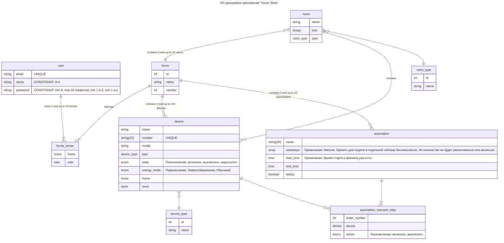

## Бизнес требования

1. Разработать приложение умного дома

## Функциональные требования

1. Управлять учетной записью:
   1. создать учетную запись;
      - Обязательные поля: Имя, Email, Пароль.
   2. войти в приложение;
   3. восстановить забытый пароль;
   4. хранить настройки умных устройств;
   5. давать доступ другим пользователям
2. Управлять умным домом:
   1. Добавлять уникальные устуройства
      1. по QR коду
      2. через уникальный номер
   2. Убирать устройства
   3. Включать и Выключать устройство
   4. Включать и выключать режим энергосбережения
   5. Добавлять комнаты
      1. Выбирать тип комнаты (см. Apple и Google)
      2. Название формировать из типа комнаты и порядкового номера
      3. Изменять тип комнаты
   6. Удалять комнаты
   7. Добавлять устройство в комнату
   8. Удалять устройство из комнаты
   9. Включать и Выключать все устройства в комнате
3. Управлять маркетинговыми инструментами:
   1. Собирать статистику о количестве пользователей
   2. Отрпавлять пуш-уведомления
   3. Отправлять Email рассылки

## Словарь данных приложения "Home Stets"

| Элемент данных           | Описание                                                                                                                             | Структура или тип данных | Длина         | Значения                                                               |
| ------------------------ | ------------------------------------------------------------------------------------------------------------------------------------ | ------------------------ | ------------- | ---------------------------------------------------------------------- |
| user                     | Учетная запись пользователя                                                                                                          | + email                  |               |                                                                        |
|                          |                                                                                                                                      | + name                   |               |
|                          |                                                                                                                                      | + password               |               |
| email                    | Логин пользователя                                                                                                                   | Строка                   | 255           | RFC 2821                                                               |
| name                     | Имя пользователя                                                                                                                     | Строка                   | 255           | Буквы русского алфавита. Пробелы.                                      |
| password                 | Пароль пользователя                                                                                                                  | Строка                   | min 8, max 16 | Буквы латинского алфавита. Минимум 1 Прописная. Минимум одна строчная. |
|                          |                                                                                                                                      |                          |               |
| home                     | Дом                                                                                                                                  | + number                 | 2             |
|                          |                                                                                                                                      | + name                   | 255           |
| name                     | Имя дома                                                                                                                             | Строка                   | 255           |                                                                        |
| number                   |                                                                                                                                      | Число                    | 2             |
|                          |                                                                                                                                      |                          |               |
| home_owner               | Список пользователей дома                                                                                                            | + 1:10 {home}            |               |                                                                        |
|                          |                                                                                                                                      | + user                   |               |                                                                        |
| home                     |                                                                                                                                      | home                     |               |                                                                        |
| user                     |                                                                                                                                      | user                     |               |                                                                        |
|                          |                                                                                                                                      |                          |               |
| device_type              | Тип устройства                                                                                                                       | + name                   |               |
|                          |                                                                                                                                      |
| name                     |                                                                                                                                      | Строка                   | 255           |
|                          |                                                                                                                                      |                          |               |
| device                   | Умное устройство                                                                                                                     | + name                   |               |                                                                        |
|                          |                                                                                                                                      | + number                 |               |
|                          |                                                                                                                                      | + model                  |               |
|                          |                                                                                                                                      | + type                   |               |
|                          |                                                                                                                                      | + state                  |               |
|                          |                                                                                                                                      | + energy_mode            |               |
|                          |                                                                                                                                      | + home                   |               |                                                                        |
|                          |                                                                                                                                      | + (room)                 |               |
| name                     |                                                                                                                                      | Строка                   | 255           |                                                                        |
| number                   |                                                                                                                                      | Число                    | 2             | "UNIQUE"                                                               |
| model                    |                                                                                                                                      | Строка                   | 255           |                                                                        |
| type                     |                                                                                                                                      | device_type              |               |                                                                        |
| state                    |                                                                                                                                      | Число                    | 2             |                                                                        |
| energy_mode              | Примечание: цвет, яркость относятся только к лампочкам, а не всем устройствам. Регулировать цвет и яркость лампочек не входит в MVP. | Число                    | 2             |                                                                        |
| home                     |                                                                                                                                      | home                     |               |                                                                        |
| room                     |                                                                                                                                      | room                     |               |                                                                        |
|                          |                                                                                                                                      |                          |               |
| room_type                |                                                                                                                                      | + name                   |               |
|                          |                                                                                                                                      |
| name                     |                                                                                                                                      | Строка                   | 255           |
|                          |                                                                                                                                      |                          |               |
| room                     | Комната                                                                                                                              | + name                   |               |                                                                        |
|                          |                                                                                                                                      | + icon                   |               |
|                          |                                                                                                                                      | + type                   |               |
| name                     |                                                                                                                                      | Строка                   | 255           |                                                                        |
| icon                     |                                                                                                                                      | Изображение              |               |                                                                        |
| type                     |                                                                                                                                      | room_type                |               |                                                                        |
| home_room                |                                                                                                                                      | + 1:10 {home}            |               |
|                          |                                                                                                                                      | + room                   |               |
| home                     |                                                                                                                                      | home                     |               |
| room                     |                                                                                                                                      | room                     |               |
|                          |                                                                                                                                      |                          |               |
| automation               | Сценарий автоматизации                                                                                                               | + name                   |               |                                                                        |
|                          |                                                                                                                                      | + weekdays               |               |
|                          |                                                                                                                                      | + start_time             |               |
|                          |                                                                                                                                      | + end_time               |               |
|                          |                                                                                                                                      | + status                 |               |
| name                     |                                                                                                                                      | Строка                   | 255           |                                                                        |
| weekdays                 |                                                                                                                                      | Строка                   | 255           |                                                                        |
| start_time               | время старта                                                                                                                         | Время. чч:мм             |               |                                                                        |
| end_time                 | время окончания                                                                                                                      | Время. чч:мм             |               |                                                                        |
| status                   | Состояние сценария. Чтобы деактивировать, не удалять.                                                                                | Булево                   |               |
|                          |                                                                                                                                      |                          |               |
| automation_scenario_step | Список устройств в сценарии автоматизации                                                                                            | + order_number           |               |                                                                        |
|                          |                                                                                                                                      | + device                 |               |
|                          |                                                                                                                                      | + action                 |               |
| order_number             |                                                                                                                                      | Число                    | 2             |                                                                        |
| device                   |                                                                                                                                      | device                   |               |                                                                        |
| action                   |                                                                                                                                      | Число                    | 2             | "Перечисление: включить, выключить"                                    |
|                          |                                                                                                                                      |                          |               |