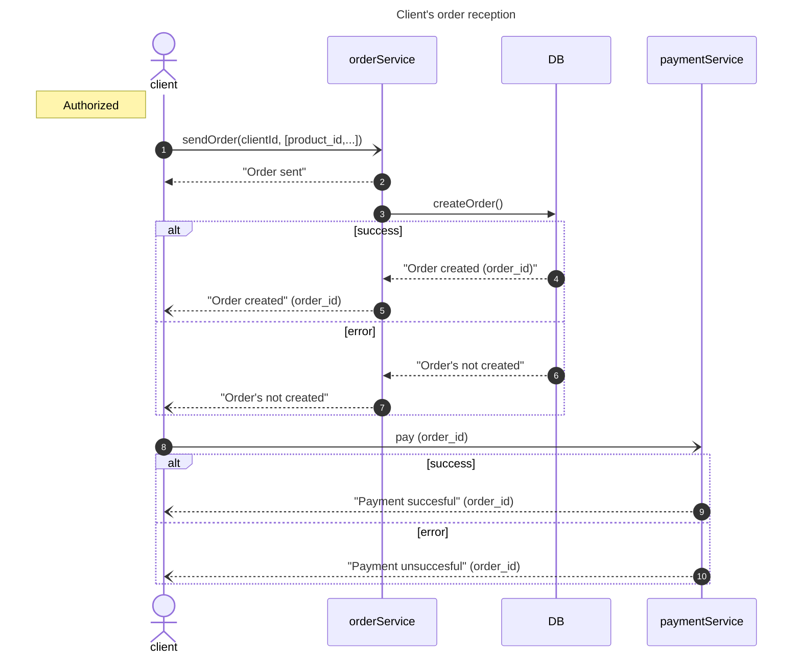

# Кейс
Cпроектировать REST API по приему заявок для сервиса заявок.
---
Сам сервис принимает заявку от клиента, сохраняет в БД и возвращает ответ клиенту.  
В заявке есть сущности **Клиент**, **Платеж**, **Продукт**. Атрибуты заявки надо продумать самим. Необходимо:
- Определить метод и url.
- Подготовить пример запроса и ответа в формате json.
- Подготовить json-схему запроса и ответа.
- Описать основной и альтернативные сценарии работы сервиса.
---

