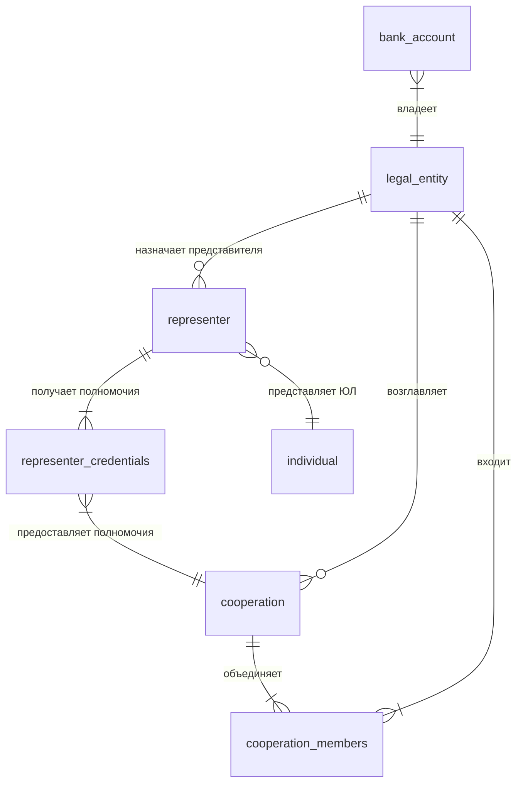

## Глоссарий
| Термин                          | Определение                                                                                              |
| ------------------------------- | -------------------------------------------------------------------------------------------------------- |
| Клиент                          | юридическое лицо (ЮЛ)                                                                                    |
| Связанное физическое лицо (СФЛ) | представитель ЮЛ.                                                                                        |
| Кооперация                      | группа ЮЛ, которые действуют на выполнение общей задачи. Пример: несколько организаций строят жилой дом. |
| Транзакционная система          | "АС1". В которой отражаются транзакции по счетам Клиентов.                                               |
| Фабрика данных                  | "АС2". В которую должны отгружаться данные из основных АС банка. Используется для отчетов.               |
| Продуктовая фабрика             | "АС3". Должна хранить полномочия СФЛ.                                                                    |
| Интернет-банк                   | "АС4". Клиентское web-приложение (личный кабинет Клиента), в которое необходимо вывести информацию.      |

## Декомпозиция задачи
### Epic
E-0: Отчеты клиентов.
### Feature
F-0: Дашборд по счетам кооперации.
### User Stories
- US-0: Дашборд по счету ЮЛ.  
Как Связанное Физическое Лицо,  
я хочу просматривать агрегированную информацию (дашборд) по рассчетным счетам своей организации,  
чтобы действовать на выполнение задач своей организации.  

- US-1: Права СФЛ на кооперацию.  
Как сотрудник банка,  
я хочу вводить информацию о полномочиях СФЛ на просмотр данных по кооперациям,  
чтобы СФЛ мог действовать на выполнение общей задачи кооперации.
- US-2: Дашборд по счетам доступных СФЛ коопераций.  
Как Связанное Физическое Лицо,  
я хочу просматривать дашборд по рассчетным счетам доступных коопераций,  
чтобы действовать на выполнение общей задачи кооперации.
