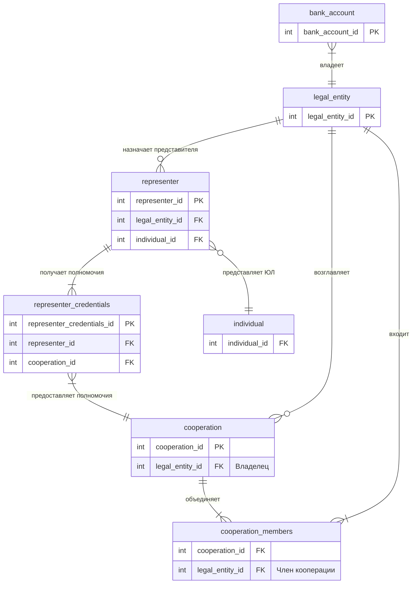
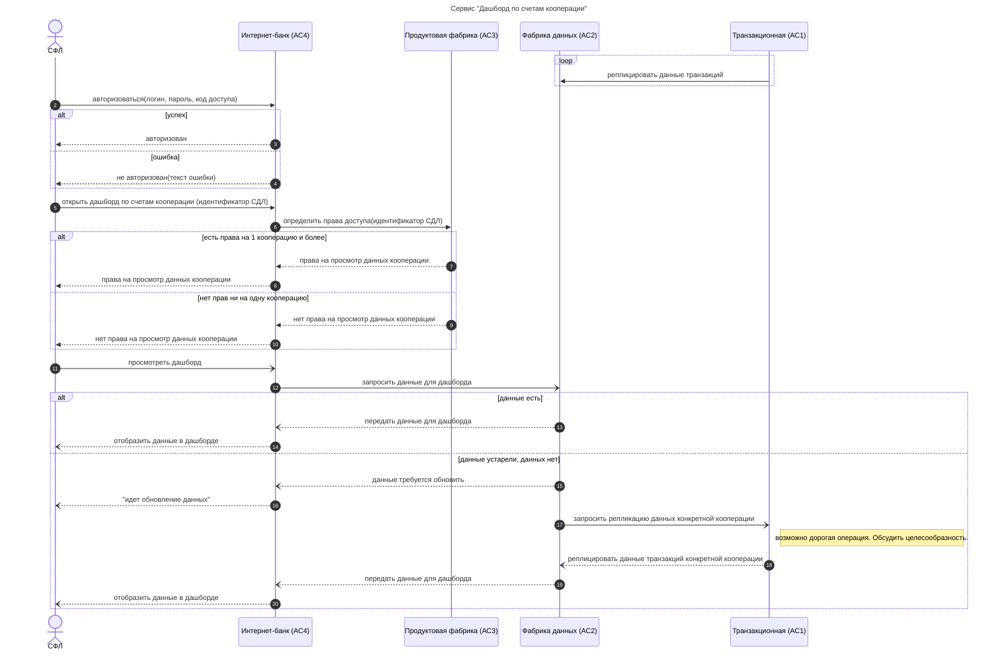

# Реализовать бизнес-сервис "Дашборд по счетам кооперации."
Сервис предоставляет клиенту-ЮЛ агрегированную информацию (дашборд) о транзакциях по его расчетным счетам, а также по расчетным счетам контрагентов, входящих в кооперацию, возглавляемую этим клиентом.  
Дополнительная информация:
- ЮЛ предоставляет СФЛ полномочия на доступ к данным в рамках одной или нескольких коопераций, возглавляемых этим ЮЛ. Данные о полномочиях СФЛ необходимо хранить в продуктовой фабрике (АС3). Данные в систему должны вводиться сотрудником Банка. 
- СФЛ должен авторизоваться в клиентском приложении, а после успешной авторизации будет получать сводную информацию по тем кооперациям, доступ к которым определен ЮЛ
- Данные для построения дашборда клиентское приложение (АС4) будет получать из фабрики данных (АС2)
- Данные о транзакциях по клиентским счетам с определенной периодичностью реплицируются в фабрику данных (АС2) из транзакционной АС (АС1)

Задание:
1.	Декомпозировать задачу на подзадачи
2.	Описать, какие вопросы должны быть решены в рамках каждой из подзадач
3.	Нарисовать диаграмму последовательности основного сценария работы бизнес-сервиса
4.	Подготовить описание (для разработки) метода REST API в фабрике АС3: метод получения полномочий СФЛ.
---
## Глоссарий
| Термин                          | Определение                                                                                              |
| ------------------------------- | -------------------------------------------------------------------------------------------------------- |
| Клиент                          | юридическое лицо (ЮЛ)                                                                                    |
| Связанное физическое лицо (СФЛ) | представитель ЮЛ.                                                                                        |
| Кооперация                      | группа ЮЛ, которые действуют на выполнение общей задачи. Пример: несколько организаций строят жилой дом. |
| Транзакционная система          | "АС1". В которой отражаются транзакции по счетам Клиентов.                                               |
| Фабрика данных                  | "АС2". В которую должны отгружаться данные из основных АС банка. Используется для отчетов.               |
| Продуктовая фабрика             | "АС3". Должна хранить полномочия СФЛ.                                                                    |
| Интернет-банк                   | "АС4". Клиентское web-приложение (личный кабинет Клиента), в которое необходимо вывести информацию.      |

## Предположения и допущения
- Репликация данных из АС1 в АС2 реализована
- Интерфейс разрабатывает дизайнер
- Модель данных упрощена. Предполагается, что в реальной системе значительно больше атрибутов.
## Декомпозиция задачи
### Epic
E-0: Отчеты клиентов.

### Feature
F-0: Дашборд по счетам кооперации.

### User Stories
- US-0: Дашборд по счету ЮЛ.  
Как Связанное Физическое Лицо,  
я хочу просматривать агрегированную информацию (дашборд) по транзакциям рассчетных счетов своей организации,  
чтобы действовать на выполнение задач своей организации.  
  - **Вопросы и примечания:**  
    - Как будут использоваться данные из дашборда?
    - За какой период нужны данные?
    - По каким полям нужно группировать данные?
    - Счета-исключения нужны?
    - Нужно ли подгружать данные онлайн из АС1, если данные в АС2 устарели?
    - Какой способ визуализации нужен?
    - Дашборд должен быть интерактивным?  
  - **Критерии приемки**  
    - Дашборд можно открыть из Интернет-банка
    - В дашборде можно выбрать период
    - В дашборде можно выбрать счет
    - Дашборд показывает сводные данные по транзакциям организации за период по выбранным счетам

- US-1: Права СФЛ на кооперацию.  
Как сотрудник банка,  
я хочу вводить информацию о полномочиях СФЛ на просмотр данных по кооперациям,  
чтобы СФЛ мог действовать на выполнение общей задачи кооперации.  
  - **Вопросы и примечания:** 
    - Полномочия СФЛ ограничены по времени?
  - **Критерии приемки**  
    - Сотрудник банка может выполнять CRUD операции (Создать, Прочитать, Изменить, Удалить) с правами СФЛ

- US-2: Дашборд по счетам доступных СФЛ коопераций.  
Как Связанное Физическое Лицо,  
я хочу просматривать дашборд по рассчетным счетам доступных коопераций,  
чтобы действовать на выполнение общей задачи кооперации.
  - **Критерии приемки**  
    - В Дашборде можно выбрать кооперацию
    - Дашборд показывает свобдные данные по транзакциям за период по выбранным кооперациям
    - Выбор счетов ограничивается выбранными кооперациями

## Логическая модель данных

## Диаграмма последовательности


## Спецификация API
```YAML
openapi: "3.0.2"
info:
  title: Продуктовая фабрика АС3 API
  version: "1.0"
servers:
  - url: https://as3.bank.ru/api/v1
paths:
  /representer-credentials:
    get:
      summary: Получить права СФЛ.
      description: Получить права СФЛ id представителя и id ЮЛ. Максимальный лимит по умолчанию 100.
      operationId: invest-idea-list
      parameters:
        - name: representer-id
          in: header
          description: id представителя.
          required: true
          style: simple
          schema:
            type: integer
        - name: legal-entity-id
          in: header
          description: id представителя.
          required: true
          style: simple
          schema:
            type: integer
        - name: credentials-limit
          in: header
          description: Лимит на количество возвращаемых элементов.
          required: false
          style: simple
          schema:
            type: integer
            default: 100
      responses:
        "200":
          description: Массив коопераций с правом на просмотр данных.
          content:
            application/json:
              schema:
                type: array
                items:
                  $ref: "#/components/schemas/cooperations"
        "400":
          description: Некорректный запрос.
          content:
            application/json:
              schema:
                $ref: "#/components/schemas/error"
        "500":
          description: Ошибка сервера.
          content:
            application/json:
              schema:
                $ref: "#/components/schemas/error"        
        default:
          description: Непредвиденная ошибка
          content:
            application/json:
              schema:
                $ref: "#/components/schemas/error"
components:
  schemas:
    cooperations:
      allOf:
        - $ref: "#/components/schemas/cooperation"
        - type: object
          required:
            - id
          properties:
            id:
              type: integer

    cooperation:
      type: object
      required:
        - id
      properties:
        id:
          type: string
    error:
      type: object
      required:
        - code
        - message
      properties:
        code:
          type: integer
        message:
          type: string

```