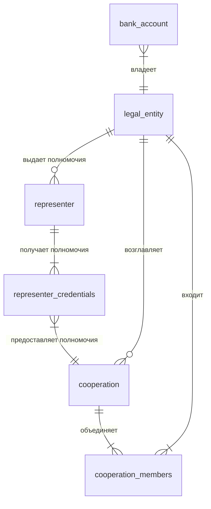

## Глоссарий
| Термин                          | Определение                                                                                              |
| ------------------------------- | -------------------------------------------------------------------------------------------------------- |
| Клиент                          | юридическое лицо (ЮЛ)                                                                                    |
| Связанное физическое лицо (СФЛ) | представитель ЮЛ.                                                                                        |
| Кооперация                      | группа ЮЛ, которые действуют на выполнение общей задачи. Пример: несколько организаций строят жилой дом. |
| Транзакционная система          | "АС1". В которой отражаются транзакции по счетам Клиентов.                                               |
| Фабрика данных                  | "АС2". В которую должны отгружаться данные из основных АС банка. Используется для отчетов.               |
| Продуктовая фабрика             | "АС3". Должна хранить полномочия СФЛ.                                                                    |
| Интернет-банк                   | "АС4". Клиентское web-приложение (личный кабинет Клиента), в которое необходимо вывести информацию.      |

