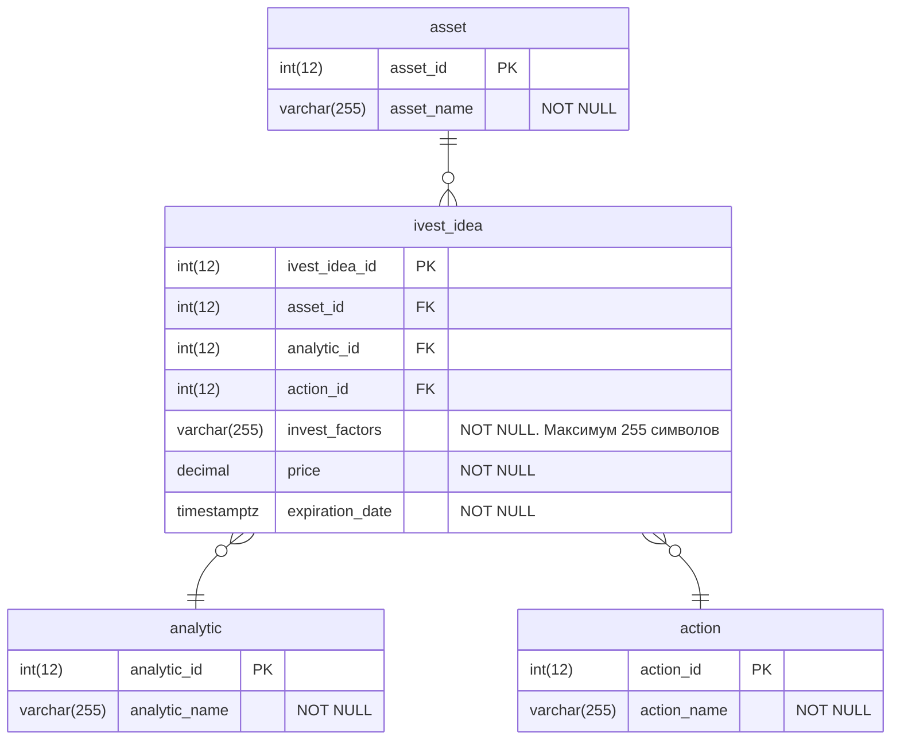

# Спроектировать бизнес функциональность отображения списка инвестидей согласно представленным макетам:
- Спроектировать модель данных.
- Реализовать скрипты таблиц и хранимых процедур БД.
- Спроектировать API.
- Описать экранные формы и работу с API.
---
> *Инвестидея* — это рекомендация *аналитиков* о том, когда и какую *ценную бумагу* стоит *купить* или *продать*, чтобы заработать. В *описание* инвестидеи входят *факторы роста* ценной бумаги, рекомендуемые *цены* *покупки* и *продажи* и *срок инвестидеи*.


## Модель данных.
> Примечание 1: invest_idea - главная сущность. Остальные сущности представлены упрощенно.  
> Примечание 2: PostgreSQL СУБД.


## SQL скрипты
### Cоздание таблиц
```SQL
USE db_assets;

DROP TABLE IF EXISTS assets;
CREATE TABLE assets
(
    asset_id int(12) NOT NULL,
    asset_name VARCHAR(255) NOT NULL,
    CONSTRAINT PK_asset_id PRIMARY KEY NONCLUSTERED (asset_id)
);

DROP TABLE IF EXISTS analytics;
CREATE TABLE analytics
(
    analytic_id int(12) NOT NULL,
    analytic_name VARCHAR(255) NOT NULL,
    CONSTRAINT PK_analytic_id PRIMARY KEY NONCLUSTERED (analytic_id)
);

DROP TABLE IF EXISTS actions;
CREATE TABLE actions
(
    action_id int(12) NOT NULL,
    action_name VARCHAR(255) NOT NULL,
    CONSTRAINT PK_action_id PRIMARY KEY NONCLUSTERED (action_id)
);

DROP TABLE IF EXISTS invest_ideas;
CREATE TABLE countries
(
    ivest_idea_id int(12)
    -- pk
    asset_id int(12)                 ,
    -- fk
    analytic_id int(12)                 ,
    -- fk
    action_id int(12)                 ,
    -- fk
    invest_factors VARCHAR(255) NOT NULL,
    price decimal NOT NULL,
    expiration_date timestamptz
        CONSTRAINT PK_invest_idea_id PRIMARY KEY NONCLUSTERED (invest_idea_id)
        CONSTRAINT fk_assets FOREIGN KEY( asset_id )
      REFERENCES assets( asset_id )
      ON DELETE CASCADE
        CONSTRAINT fk_analytics FOREIGN KEY( analytic_id )
      REFERENCES analytics (analytic_id)
      ON DELETE CASCADE
        CONSTRAINT fk_actions FOREIGN KEY( action_id )
      REFERENCES actions( action_id )
      ON DELETE CASCADE
);
```
### Хранимые процедуры
```SQL
CREATE OR REPLACE FUNCTION get_ivest_ideas (asset_ids ARRAY, asset_limit int DEFAULT 100) --получить список инвест идей по массиву id активов
RETURNS void AS $
BEGIN
  SELECT
      asset_id
    , analytic_id
    , action_id
    , invest_factors
    , price
    , expiration_date
  FROM
  WHERE
    asset_id IN (asset_ids)
  LIMIT asset_limit
END
$ LANGUAGE plpgsql;

```
## Спецификация API
```YAML
openapi: '3.0.2'
info:
  title: Инвест идеи API
  version: '1.0'
servers:
  - url: https://server.com/api/invest-ideas/v1
paths:
  /ivest-ideas:
    get:
      summary:  Получить инвест идеи.
      description: Получить инвест список инвест идей по массиву id активов. Максимальный лимит по умолчанию 100.
      operationId: invest-idea-list
      parameters: 
        - name: assets-ids
          in: header
          description: Список id активов.
          required: true
          style: simple
          schema:
            type: array
            items:
              type: integer
        - name: asset-limit
          in: header
          description: Лимит на количество возвращаемых идей.
          required: false
          style: simple
          schema:
            type: integer
            default: 100
      responses:
        '200':
          description: Массив инвест идей.
          content:
            application/json:
              schema:
                type: array
                items:
                  $ref: '#/components/schemas/Idea'
        default:
          description: unexpected error
          content:
            application/json:
              schema:
                $ref: '#/components/schemas/Error'
  /ivest-ideas/{id}:
    get: 
      summary: Получить инвест идею.
      description: Получить одну инвест идею по ее id.
      operationId: ivest-idea
      parameters: 
        - name: id
          in: path
          required: true
          style: simple
          schema: 
            type: integer
      responses:
        '200':
          description: Одна ивенст идея.
          content:
            application/json:
              schema:
                type: array
                items:
                  $ref: '#/components/schemas/Idea'
        default:
          description: unexpected error
          content:
            application/json:
              schema:
                $ref: '#/components/schemas/Error'
      
components:
  schemas:
    Idea:
      allOf:
        - $ref: '#/components/schemas/NewIdea'
        - type: object
          required:
          - id
          properties:
            id:
              type: integer
              format: int64

    NewIdea:
      type: object
      required:
        - id  
      properties:
        id:
          type: string
        asset:
          type: string
        analytic:
          type: string
        action:
          type: string
        factors:
          type: string
        price:
          type: number
        expiration-date:
          type: string

    Error:
      type: object
      required:
        - code
        - message
      properties:
        code:
          type: integer
          format: int32
        message:
          type: string
```

## Экранные формы
> Адрес API: https://server.com/api/invest-ideas/v1

### Список инвест идей
> Адрес API: https://server.com/api/invest-ideas/v1
Показывает инвест идеи с возможностью сортировки и фильтрации по всем полям.
| Элемент            | Описание                                                                    | API запрос                  | Источник данных                              |
| ------------------ | --------------------------------------------------------------------------- | --------------------------- | -------------------------------------------- |
| Актив              | Наименование актива                                                         | GET <Адрес API>/ivest-ideas | Поле "asset" элемента массива JSON           |
| Рекомендуемая Цена | Цена по которой Аналитик идем рекомендует действовать с активом.            | GET <Адрес API>/ivest-ideas | Поле "price" элемента массива JSON           |
| Дата истечения     | Наименование актива                                                         | GET <Адрес API>/ivest-ideas | Поле "expiration-date" элемента массива JSON |
| Аналитик           | Конкретный Аналитик-автор идеи. Пример: Вася; Ира.                          | GET <Адрес API>/ivest-ideas | Поле "analytic" элемента массива JSON        |
| Кнопка "Действие"  | Действие: "Купить"; "Продать"; "Держать".                                   | GET <Адрес API>/ivest-ideas | Поле "action" элемента массива JSON          |
| Кнопка "Подробнее" | Открывает экран "Инвест идея". Делает запрос к энд поинту /ivest-ideas/{id} | GET <Адрес API>/ivest-ideas |                                              |
| Идентификатор идеи | Скрытое поле для передачи запроса                                           | GET <Адрес API>/ivest-ideas | Поле "id" элемента массива JSON              |

### Инвест идея
Показывает подробную информацию об одной инвест идее.
> Адрес API: https://server.com/api/invest-ideas/v1
| Элемент            | Описание                                                                                   | API запрос                       | Источник данных             |
| ------------------ | ------------------------------------------------------------------------------------------ | -------------------------------- | --------------------------- |
| Актив              | Наименование актива                                                                        | GET <Адрес API>/ivest-ideas/{id} | Поле "asset" JSON           |
| Рекомендуемая Цена | Цена по которой Аналитик идем рекомендует действовать с активом.                           | GET <Адрес API>/ivest-ideas/{id} | Поле "price" JSON           |
| Дата истечения     | Наименование актива                                                                        | GET <Адрес API>/ivest-ideas/{id} | Поле "expiration-date" JSON |
| Аналитик           | Конкретный Аналитик-автор идеи. Пример: Вася; Ира.                                         | GET <Адрес API>/ivest-ideas/{id} | Поле "analytic" JSON        |
| Факторы            | Факторы которые влияют на рекомендацию Аналитика                                           | GET <Адрес API>/ivest-ideas/{id} | Поле "factors" JSON         |
| Кнопка "Действие"  | Действие: "Купить"; "Продать"; "Держать".                                                  | GET <Адрес API>/ivest-ideas/{id} | Поле "action" JSON          |
| Кнопка "Назад"     | Возвращает к списку на экран "Список инвест идей". Делает запрос к энд поинту /ivest-ideas | GET <Адрес API>/ivest-ideas/{id} | Поле "action" JSON          |
