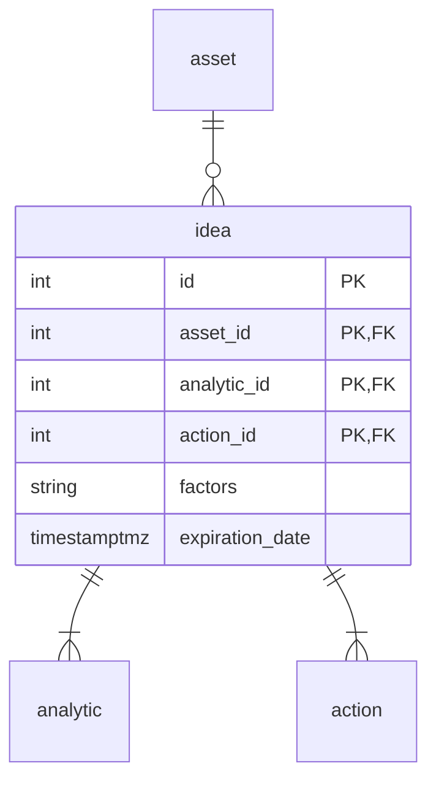

# Спроектировать бизнес функциональность отображения списка инвестидей согласно представленным макетам:
- Спроектировать модель данных.
- Реализовать скрипты таблиц и хранимых процедур БД.
- Спроектировать API.
- Описать экранные формы и работу с API.
---
> *Инвестидея* — это рекомендация *аналитиков* о том, когда и какую *ценную бумагу* стоит *купить* или *продать*, чтобы заработать. В *описание* инвестидеи входят *факторы роста* ценной бумаги, рекомендуемые *цены* *покупки* и *продажи* и *срок инвестидеи*.

