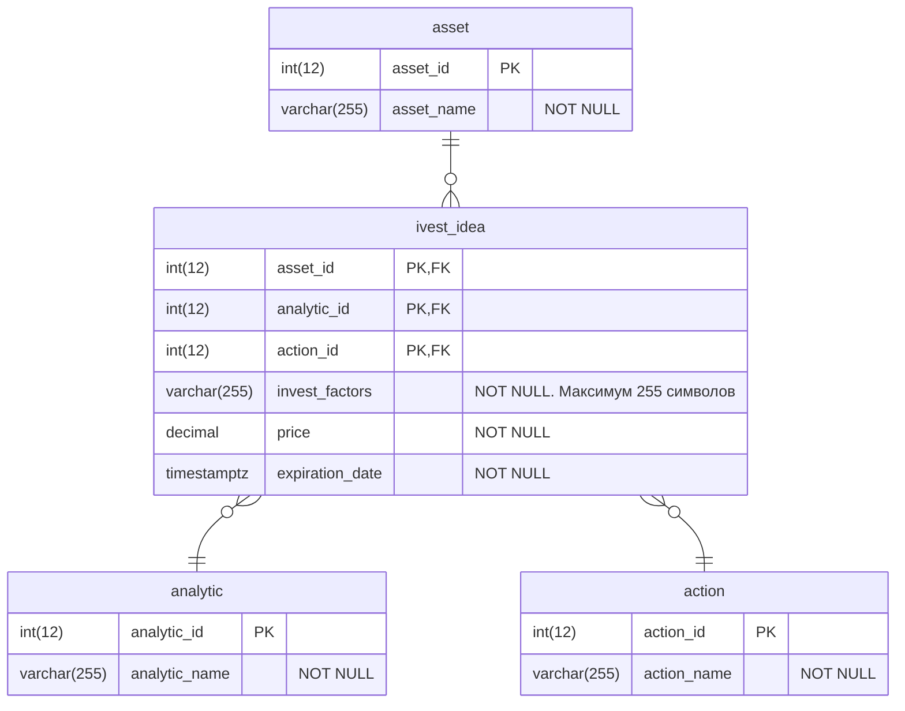

# Спроектировать бизнес функциональность отображения списка инвестидей согласно представленным макетам:
- Спроектировать модель данных.
- Реализовать скрипты таблиц и хранимых процедур БД.
- Спроектировать API.
- Описать экранные формы и работу с API.
---
> *Инвестидея* — это рекомендация *аналитиков* о том, когда и какую *ценную бумагу* стоит *купить* или *продать*, чтобы заработать. В *описание* инвестидеи входят *факторы роста* ценной бумаги, рекомендуемые *цены* *покупки* и *продажи* и *срок инвестидеи*.


## Модель данных.
> Примечание 1: invest_idea - главная сущность. Остальные сущности представлены упрощенно.  
> Примечание 2: PostgreSQL СУБД.


## SQL скрипты
### Cоздание таблиц
```SQL
USE db_assets;

DROP TABLE IF EXISTS assets;
CREATE TABLE assets
(
    asset_id int NOT NULL,
    asset_name VARCHAR(255) NOT NULL,
    CONSTRAINT PK_asset_id PRIMARY KEY NONCLUSTERED (asset_id)
);

DROP TABLE IF EXISTS analytics;
CREATE TABLE analytics
(
    analytic_id int NOT NULL,
    analytic_name VARCHAR(255) NOT NULL,
    CONSTRAINT PK_analytic_id PRIMARY KEY NONCLUSTERED (analytic_id)
);

DROP TABLE IF EXISTS actions;
CREATE TABLE actions
(
    action_id int NOT NULL,
    action_name VARCHAR(255) NOT NULL,
    CONSTRAINT PK_action_id PRIMARY KEY NONCLUSTERED (action_id)
);

DROP TABLE IF EXISTS invest_ideas;
CREATE TABLE countries
(
    asset_id int                 ,
    -- pk, fk
    analytic_id int                 ,
    -- pk, fk
    action_id int                 ,
    -- pk, fk
    invest_factors VARCHAR(255) NOT NULL,
    price decimal NOT NULL,
    expiration_date timestamptz
        CONSTRAINT fk_assets FOREIGN KEY( asset_id )
      REFERENCES assets( asset_id )
      ON DELETE CASCADE
        CONSTRAINT fk_analytics FOREIGN KEY( analytic_id )
      REFERENCES analytics (analytic_id)
      ON DELETE CASCADE
        CONSTRAINT fk_actions FOREIGN KEY( action_id )
      REFERENCES actions( action_id )
      ON DELETE CASCADE
);
```
### Хранимые процедуры
```SQL
CREATE OR REPLACE FUNCTION get_ivest_ideas (asset_ids ARRAY) --получить список инвест идей по массиову id активов
RETURNS void AS $
BEGIN
  SELECT
      asset_id
    , analytic_id
    , action_id
    , invest_factors
    , price
    , expiration_date
  FROM
  WHERE
    asset_id IN (asset_ids)
END
$ LANGUAGE plpgsql;

```